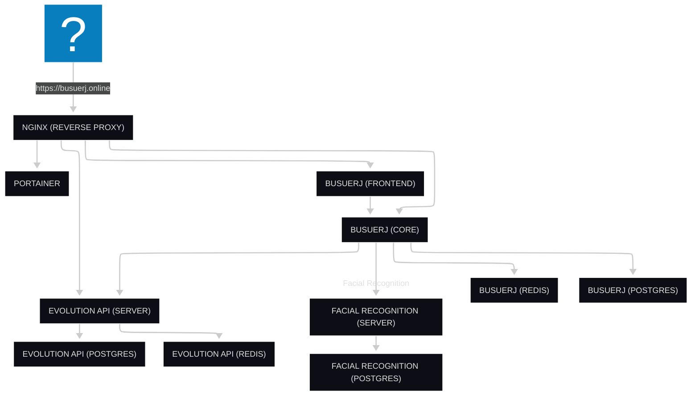

# BusUERJ: Plataforma de Reserva de Assentos para Ônibus Universitários

> [https://busuerj.online](https://busuerj.online)

## O que é o BusUERJ?

O **BusUERJ** é uma **plataforma on-premise** desenvolvida para o **gerenciamento de reservas de assentos em viagens rodoviárias de ônibus universitários**.  

O projeto nasceu da **necessidade de otimizar a organização das viagens intermunicipais** da **UERJ – campus Nova Friburgo**, aliando a resolução de um problema real à **exploração de um tema para o Trabalho de Conclusão de Curso em Engenharia de Computação**.

## Principais Funcionalidades

| Funcionalidade | Status |
|----------------|---------|
| Autenticação e gestão de usuários com base em e-mails institucionais ou domínios previamente cadastrados | Feito |
| Gerenciamento completo de viagens, incluindo locais, rotas, motoristas e veículos | Em melhoria |
| Agendamento automático de viagens recorrentes, reduzindo tarefas manuais | Feito |
| Notificações via WhatsApp sobre status de viagens, reservas e cancelamentos | Feito |
| Validação facial para embarque, facilitando a identificação dos passageiros | Em desenvolvimento |
| Envio automatizado de alertas, passagens e informações importantes por e-mail | Backlog |
| Controle de reservas e assentos disponíveis, prevenindo overbooking | Feito |
| Rastreamento em tempo real da localização dos ônibus | Backlog |
| Exibição da previsão do tempo no destino da viagem | Backlog |

## Arquitetura

## Stack de desenvolvimento

